# An English News Website

## Description

This is a responsive news website built with Next.js, TypeScript, and SASS. This project was made as a portfolio project, which shows my ability to work with Next.js.

## Technologies

- Next.js
- React
- TypeScript
- SASS

## How to Run

You can use this project in one of the following ways:

### Option 1: Use the Live Version

Simply open [this link](https://en-news-website.vercel.app/) in your browser to access the application online

### Option 2: Run Locally

1. Clone the repository:

   ```bash
   git clone https://github.com/KreimerR/en-news-website.git
   ```

2. Navigate to the project folder:

   ```bash
   cd en-news-website
   ```

3. Install npm packages:

   ```bash
   npm install
   ```

4. Start the development server:
   ```bash
   npm run dev
   ```

## Features

- Home page
- Specific pages
- Articles
- Menu
- Responsiveness
- Routing

## Screenshots

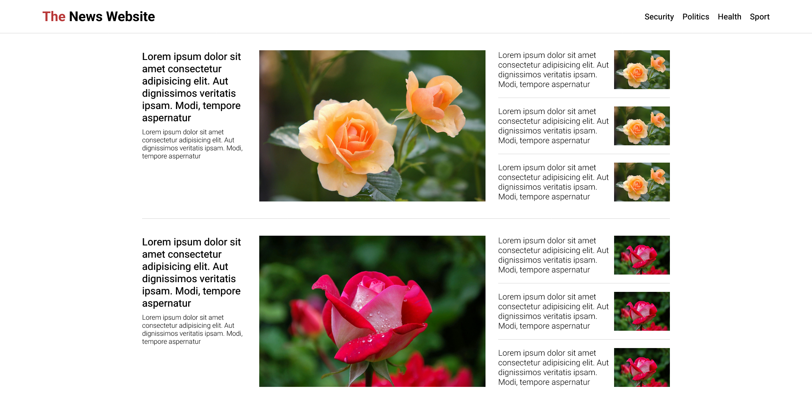
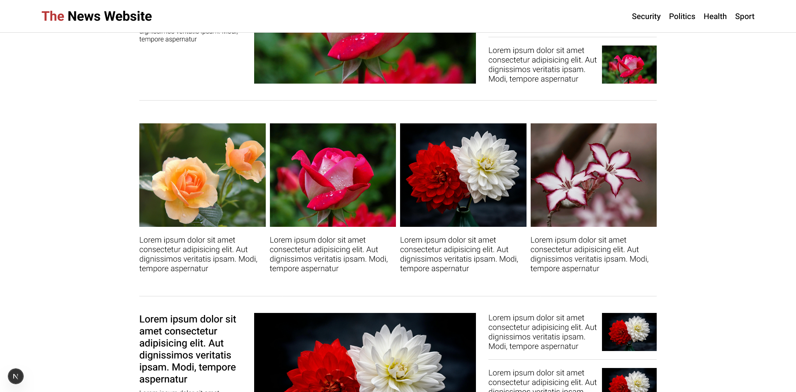
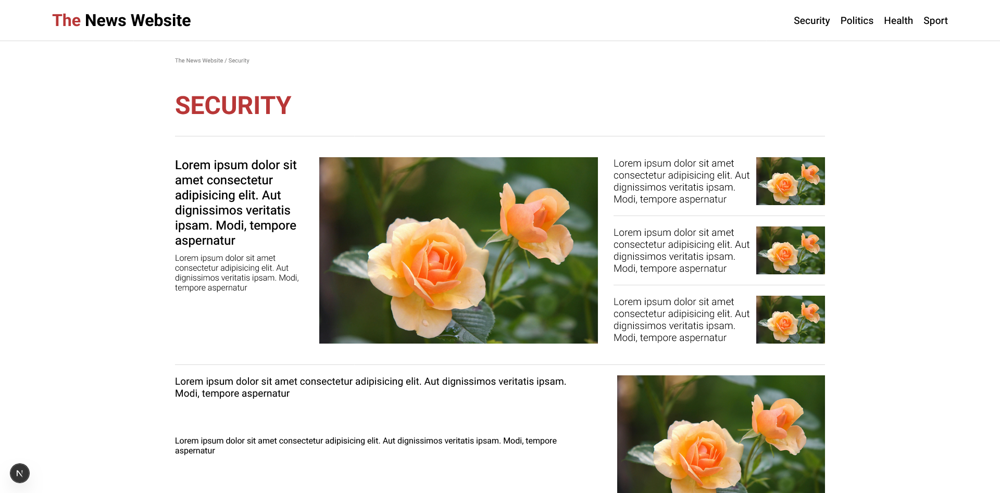
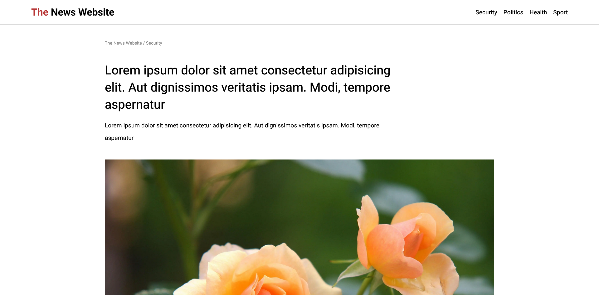
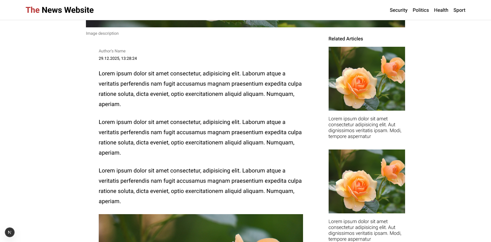
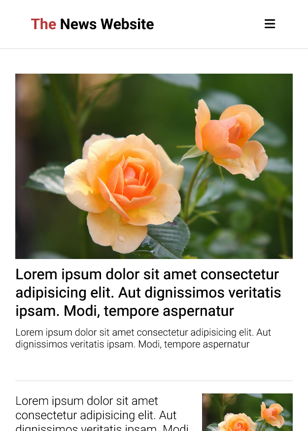
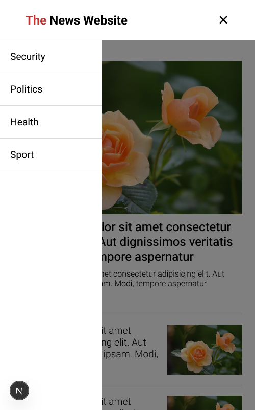
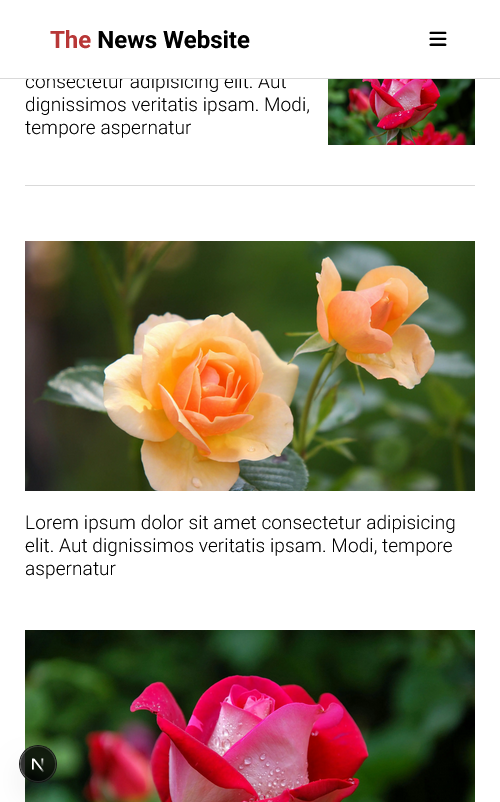
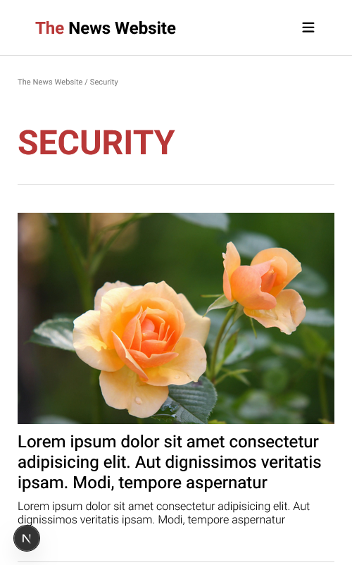

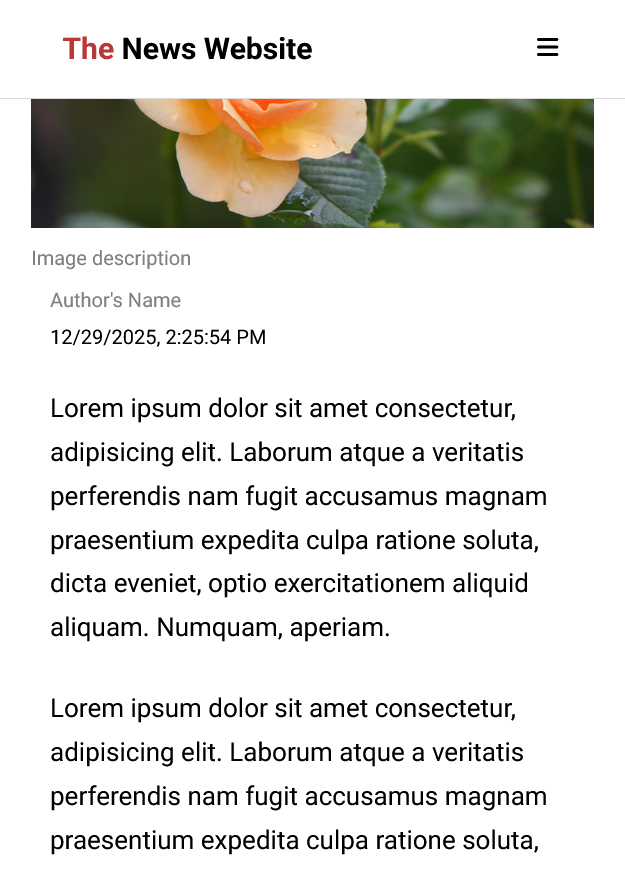
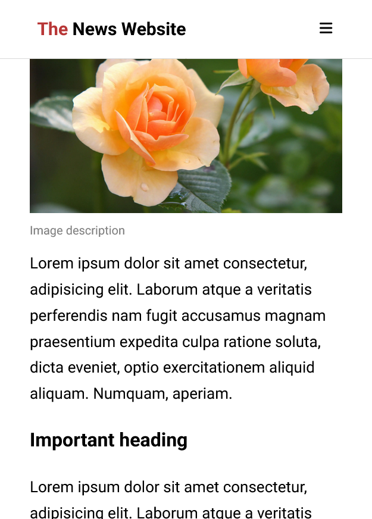
